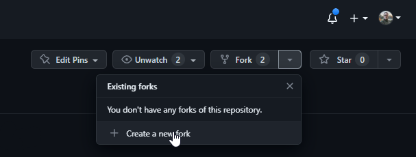
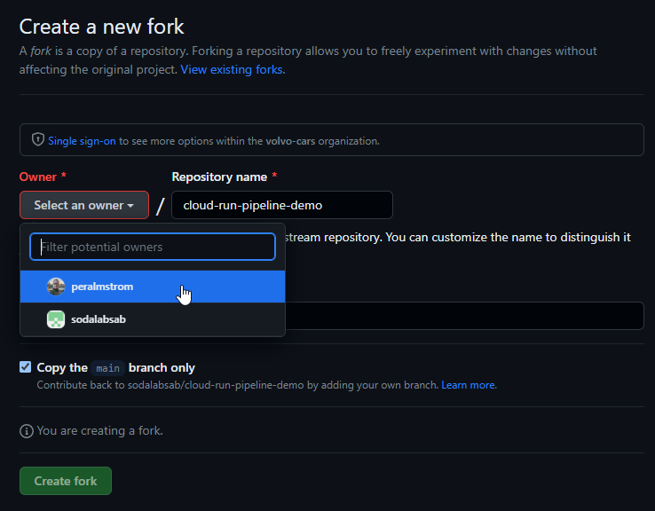
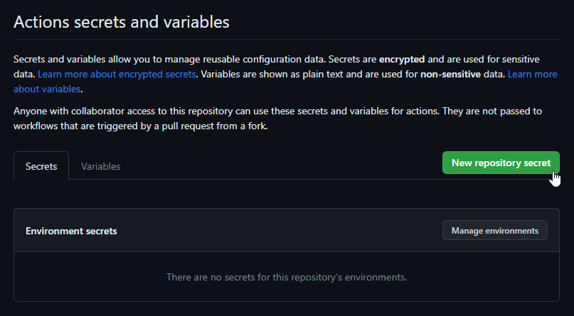
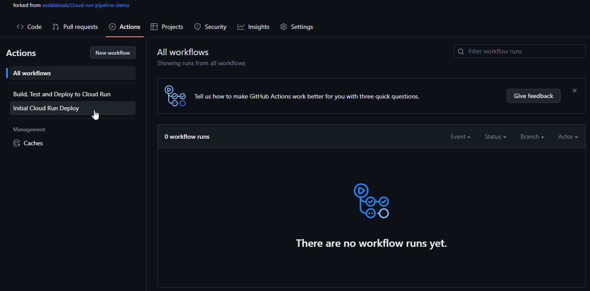
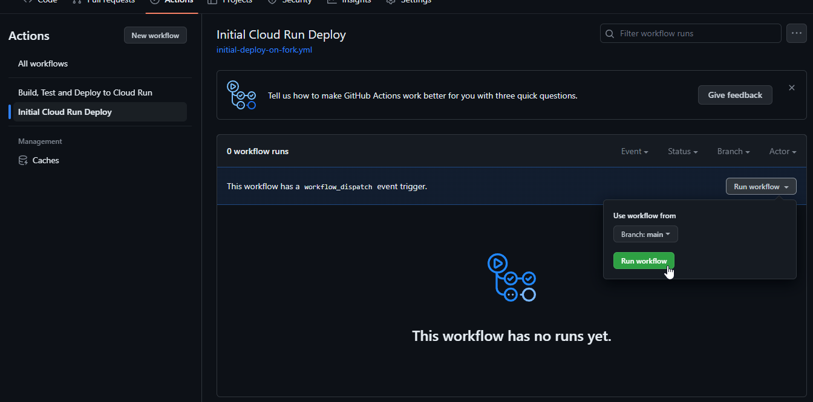

# CI/CD course
This course will guide you through setting up and using a pipeline GitHub Actions and Google Cloud services that serves as a fundation in a CI/CD setup for a demoapplication. Below are detailed instructions for cloning the course code, setting up your local environment, configuring and integrating accounts, and deploying infrastructure and applications.

# cloud-run-pipeline-demo

---

## Setup 1

### Tools and Accounts Setup for lab 1 and 2

1. **Microsoft Visual Studio Code (VS Code)**
   - Download and install from: [https://code.visualstudio.com/](https://code.visualstudio.com/)
   - Install helpful extensions: Docker and Git.

2. **Git (if that is not already on your computer)**
   - Download and install from: [https://git-scm.com/](https://git-scm.com/)
   - Configure Git with your name and email:
     ```bash
     git config --global user.name "Your Name"
     git config --global user.email "your.email@example.com"
     ```
   - Verify Git installation:
     ```bash
     git --version
     ```

3. **GitHub Account**
   - Sign up: [https://github.com/join](https://github.com/join)
   - Configure ssh access to GitHub by [following this instruction](https://docs.github.com/en/authentication/connecting-to-github-with-ssh/generating-a-new-ssh-key-and-adding-it-to-the-ssh-agent)

4. **Fork the course Repository into your GitHub Account**
   - Go to [the course reporitory](https://github.com/sodalabsab/scalingcloud.git)
   - Select "Fork" to create your own disconnected version of the course code repository
   - Name the repository "scalecloud" click on "Create fork"

5. **Download the repository localy**
   - Go to the newly created repo in your github account and click on the green "<>Code" button. Copy the SSH URL and open a comand shell on your computer. Paste in this command to create a local repository (connected to the github repository)
     ```bash
     git clone git@github.com:<your-username>/scalecloud.git
     ```
   - Replace `<your-username>` with your GitHub username.
   - Change directory into the repo:
     ```bash
     cd scalecloud
     ```
   - Verify the repo with the command
     ```bash
     git remove -v
     ```  
     You sould see something like: `origin	git@github.com:<your usernam>/scalingcloud.git (push)`

6. **Docker (requires local admin)**
   - Donload and install from: [https://www.docker.com/products/docker-desktop](https://www.docker.com/products/docker-desktop)
   - Ensure Docker is running and verify installation:
     ```bash
     docker --version
     ```

7. **Open the code in VS Code**
   - Start VS Code and open the directory by selecting "Open folder..." from the File meny

# Setup 2 - move to the cloud

This part explores some of the avaliable tools to build, deploy and monitor applications in Azure. There are a few things required to be setup to be able to run the labs. 

1. **Azure Account**
   - Sign up: [https://azure.microsoft.com/free/](https://azure.microsoft.com/free/)
   - Ensure your subscription is active (you should be able to create a free tier subscriptioin)

2. **(Optional) Azure CLI**
   - Install from: [https://docs.microsoft.com/en-us/cli/azure/install-azure-cli](https://docs.microsoft.com/en-us/cli/azure/install-azure-cli)
   - Log in to your Azure account:
     ```bash
     az login
     ```

7. **(Optional) Bicep CLI**
   - Install Bicep using Azure CLI:
     ```bash
     az bicep install
     ```
   - Verify Bicep installation:
     ```bash
     az bicep version
     ```

## GitHub actions Setup for Azure Bicep Deployment

### Configure GitHub Secrets

You need to configure the following GitHub Secrets in your repository for secure deployment. These secrets are referenced in the actions workflows and in bicep files.

#### Steps to Configure Secrets

1. Go to your repository's **Settings**.
2. Navigate to **Secrets and variables** > **Actions**.
3. Add the following secrets:
   - `AZURE_SUBSCRIPTION_ID`: Your Azure subscription ID.
   - `AZURE_RESOURCE_GROUP`: Provide a suitable name of the resource groups that will be created and used for the labs.
   - `DOCKERHUB_PASSWORD`: Your password to dockerhub.com (used for rebuilding and pushing a new version of `my-website`) 
   - `DOCKERHUB_IMAGE`: The name of your image that ws pushed to dockerhub.com in lab1. It will be used as input into the bicep file that sets up the labs in azure.  

### Setting Up Azure Credentials in GitHub

To deploy Azure resources using GitHub Actions, you need to create and configure Azure credentials securely in your GitHub repository. We need to create a service principal (server account) in Azure and give to GitHub to allow access from GitHub Actions into Azure. Here's how to do it:

1. **Create a Service Principal**
   - Run the following command to create a new service principal and capture the output, which includes your `appId`, `password`, and `tenant`:
     ```bash
     az account show --query id --output tsv 
     az ad sp create-for-rbac --name "github-actions-deploy" --role contributor --scopes /subscriptions/<AZURE_SUBSCRIPTION_ID> --sdk-auth
     ```
   - Replace `<AZURE_SUBSCRIPTION_ID>` with your actual Azure subscription ID from the first command. (You can also find the subscription ID in the portal)
   - The output will look like this:
     ```json
     {
       "appId": "YOUR_APP_ID",
       "displayName": "github-actions-deploy",
       "password": "YOUR_PASSWORD",
       "tenant": "YOUR_TENANT_ID"
     }
     ```

3. **Store Azure Credentials in GitHub Secrets**
   - Go to your GitHub repository and navigate to **Settings**.
   - Under **Secrets and variables**, click on **Actions**.
   - Click **New repository secret** and add a secret named `AZURE_CREDENTIALS`.
   - Past in the JSON ouput from step 2 so that `AZURE_CREDENTIALS` secret is a JSON string containing your credentials.

---

## Running the Azure labs

The GitHub Actions workflow `.github/workflows/lab-bicep-deploy.yml` is designed to deploy Azure resources using Bicep files located in specific directories for Labs 3, 4, and 5. It allows you to specify which lab's Bicep file to deploy using manual workflow dispatch.
This allows you to trigger the workflow and provide an input specifying the lab number (`labPath`), which points to the directory where the Bicep file is located. By default, it deploys the Bicep file for `lab3`.

### Environment Variables

- `AZURE_SUBSCRIPTION_ID`: Retrieved from GitHub Secrets and used to identify your Azure subscription.
- `AZURE_CREDENTIALS`
- `RESOURCE_GROUP`: The name of the Azure resource group, dynamically constructed using the lab path input. It appends the lab number to the base resource group name.
- `LOCATION`: Set to `swedencentral`, which is the default location for all resources.


### Jobs and Steps

The workflow contains a single job, `deploy`, that runs on an `ubuntu-latest` virtual environment and executes the following steps:

1. **Checkout Repository**
   - **Action**: `actions/checkout@v2`  
     This step checks out the code from the repository, making the Bicep files available for deployment.

2. **Log in to Azure**
   - **Action**: `azure/login@v1`  
     This step logs into your Azure account using the credentials stored in GitHub Secrets (`AZURE_CREDENTIALS`). This is necessary to authenticate and interact with Azure resources.

3. **Ensure the Resource Group Exists**
   - **Command**: 
     ```bash
     az group create --name ${{ env.RESOURCE_GROUP }} --location ${{ env.LOCATION }} --subscription ${{ secrets.AZURE_SUBSCRIPTION_ID }} --tags Project=scalingCloudLab
     ```
   - **Description**: This command creates the resource group if it does not already exist. It uses the `RESOURCE_GROUP` environment variable, which incorporates the lab path, and assigns a tag `Project=scalingCloudLab` to the resource group.

4. **Deploy Bicep File for the Specified Lab**
   - **Command**:
     ```bash
     az deployment group create --resource-group ${{ env.RESOURCE_GROUP }} --subscription ${{ secrets.AZURE_SUBSCRIPTION_ID }} --template-file ${{ github.event.inputs.labPath }}/lab.bicep --mode Incremental
     ```
   - **Description**: This command deploys the Bicep file for the specified lab. It uses the `az deployment group create` command to deploy the infrastructure defined in the `lab.bicep` file located in the directory specified by the `labPath` input. The `--mode Incremental` flag ensures that existing resources are not deleted and only new or updated resources are deployed.

---

### How to Use

1. **Trigger the Workflow Manually**:
   - Navigate to the **Actions** tab in your GitHub repository.
   - Select the **Lab Bicep Deployment** workflow.
   - Click on **Run workflow** and specify the `labPath` input (e.g., `lab3`, `lab4`, or `lab5`) to choose which lab's Bicep file to deploy.

2. **Bicep Deployment**:
   - The workflow will create or update the Azure resource group and then deploy the infrastructure using the appropriate Bicep file.

---

### Notes

- **Resource Group Naming**: The resource group name is constructed dynamically, combining a base name with the lab number. This helps in organizing resources by lab.
- **Incremental Deployment**: The `--mode Incremental` flag ensures that only changes are applied, preventing the deletion of existing resources.

This workflow provides a structured and automated way to manage Azure deployments for multiple labs, making it easy to set up and scale cloud infrastructure.
## Deploying the Test WebApp

You can deploy the test web application by:

1. **Pushing a Change**: Any change in the repository (e.g., code or configuration updates) will automatically trigger the deployment workflow.
2. **Manually Triggering**: Use the **`webapp-workflow`** in GitHub Actions to manually deploy the web app.

This will build and deploy the web application to your Azure environment.

---

## Tearing Down the Environment


### Build and Test

The application itself is built with Spring Boot 3, Java 17, and can be compiled, tested and started
locally with the included Gradle wrapper:

  ```
  ./gradlew build test
  java -jar build/libs/demo-0.0.3-SNAPSHOT.jar # or whatever version we're at
  ```

Alternatively, you can build and run it in a container:

  ```
  docker build -t demo .
  docker run --rm -p 8080:8080 demo
  # make sure it's alive
  curl localhost:8080
  ```

Once running, you will find ways to interact with the application at http://localhost:8081/.

</details>

----

<details style="background-color: #303030">
<summary><span style="font-size: 1.8em; font-weight: bold">1️⃣ First Exercise</span></summary>

### Create a Fork

Start by creating a fork of this repository under your own GitHub account. From there you can
experiment freely - even deploy it to our cloud (once we give you the necessary credentials)!



----

Select your own GitHub account as the "Owner", and click the "Create fork" button.



### Add GCP Credentials

In order to push and subsequently deploy the containerized service, we need to add the appropriate
Google Cloud credentials. Start by going into the project settings:


----

In the left-hand menu, under "Security", find "Secrets and variables". Click it, and then "Actions"
below:


----

Here, add a "New repository secret":



----

The `name` must be `GCP_CREDENTIALS`.

The `secret` will be provided by today's instructor. Copy and paste that json into the text field
and hit "Add secret":


### Enable GitHub Actions Workflow

The definition of the pipeline for this project is included as code in the project itself - GitHub
reads it from the `.github/workflows/` folder. However, it is not enabled by default. To enable it,
click "Actions" in the top project menu:


Here, you will also be informed that workflows are disabled by default. Go ahead and enable them,
and we will continue the exercise by looking at the pipeline and its steps in more detail.


----

Lastly, to verify that everything is set up and configured correctly, let's run the "Initial Cloud
Run Deploy" action:



----



----

Within seconds, the running workflow should appear:


Click it, and you will see the workflow details - including the status of the individual steps:


Once all steps are green, we're ready to move on!

This pipeline is meant to demonstrate a "basic" or "typical" setup where the service is built,
unit-tested, containerized, pushed to an artifact registry and then deployed to a staging
environment. End-to-end tests are then run and, if successful, the service is deployed to
production.

The `deploy-production` job has an `output` section which gives you the publicly accessible URL of
the deployed service.


</details>

❗ Create a fork of this repository under your own GitHub account  
❗ Deploy your service to our cloud, find and navigate to the service in your browser, and leave some
feedback for the first exercise

----

<details style="background-color: #303030">
<summary><span style="font-size: 1.8em; font-weight: bold">2️⃣ Second Exercise</span></summary>

### Teamwork

As we have seen, this service is part of a bigger whole. It talks to a "hub" service where you can
use it to leave feedback for the completed exercises. So far, the hub has been out of your control -
but now we're going to start collaborating more and adding functionality to both services in order
to increase the value for the end-users.

In this exercise, we will add some functionality to both services - allowing additional information
to be sent to the hub, and visualized on the hub dashboard.

The hub only accepts a number as feedback for an exercise, a "score" or "grade" if you will. And it
interprets it as "score for the first exercise". Or, the only exercise. But as we have now reached
exercise number two, perhaps you are starting to see the dilemma. We will have to update the API of
the hub to accept (and handle) more information - but we must do it in a controlled and structured
way so that we don't break the service for clients that haven't been updated yet.

</details>

❗ Create a PR for the "exercise 2" branch to main    
❗ Sync rollout with the instructor, making sure the backend hub is upgraded first  
❗ After the hub is upgraded, double-check that your service still works before deploying a new
version  
❗ Merge the "exercise 2" PR, wait for it to deploy, and leave some feedback for the second exercise!  
